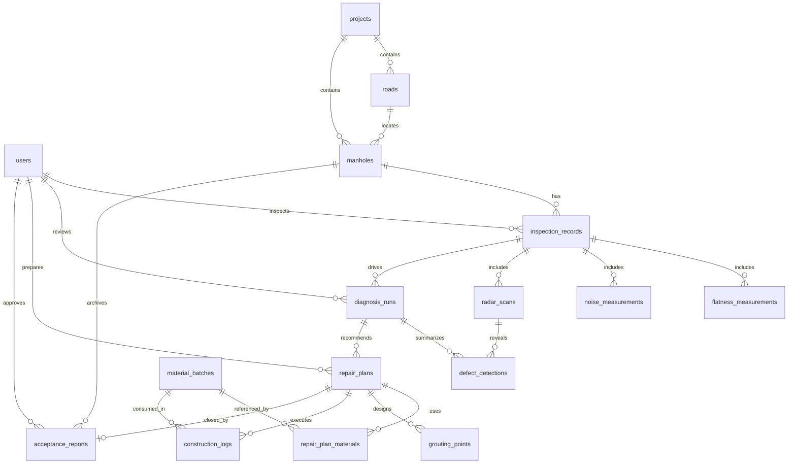

# PostgreSQL/PostGIS Schema Design

## 1. Scope And Assumptions

本稿仅覆盖数据库设计，不包含业务代码。

目标是支撑 `地图 -> 单井详情 -> AI 诊断 -> 维修方案 -> 施工模拟 -> 验收报告` 的 MVP 主流程，并满足以下约束：

- 使用 PostgreSQL + PostGIS。
- Demo 数据必须可本地重置、可确定性复现。
- 地图与几何数据默认使用虚构或脱敏坐标，不落真实客户点位。
- 至少一座高风险 Demo 井具备完整链路：
  `inspection -> radar scan -> defect detections -> diagnosis -> repair plan -> grouting points -> construction logs -> acceptance report`

## 2. Design Principles

1. `manholes` 保存当前快照。
当前地图页和详情页频繁读取 `risk_score`、`disease_level`、`asset_status`，因此将“当前状态快照”保存在 `manholes`，而非每次临时从历史检测表聚合。

2. `inspection_records` 保存一次检测头信息，明细拆到子表。
平整度、声振、雷达原始结果都可能存在多次采样或附件，因此保留 `inspection_records` 作为一次检测主记录，再拆 `flatness_measurements`、`noise_measurements`、`radar_scans` 等明细表。

3. 诊断与维修方案保留历史版本。
`diagnosis_runs`、`repair_plans` 允许重复执行和版本化，方便 Demo 展示“重新诊断”与“方案复核”。

4. 只对高频筛选字段建索引。
MVP 不预置大范围 `jsonb` GIN 索引，也不做分区，避免写放大和迁移复杂度；待真实采集量上来后再扩展。

## 3. ERD Explanation

### 3.1 ERD



### 3.2 Relationship Notes

- 一个 `project` 下有多条 `roads`，也可直接拥有多座 `manholes`。
- `manholes` 是资产主表，保存当前风险快照与地图展示字段。
- 一次 `inspection_record` 可关联多次平整度、声振、雷达采集。
- 一次 `diagnosis_run` 对应一次 AI 诊断执行，输出多个 `defect_detections` 和一个总体结论。
- 一个 `repair_plan` 可关联多个 `grouting_points` 和多条 `construction_logs`。
- `acceptance_reports` 当前按“一次已执行维修方案对应一份验收报告”设计，MVP 先不做多版本验收。

## 4. Enum Design

| Enum | Values | Notes |
| --- | --- | --- |
| `project_status` | `planning`, `active`, `archived` | Demo 先用 `active` |
| `road_class` | `expressway`, `arterial`, `secondary`, `branch` | 对应交通等级展示 |
| `manhole_type` | `storm`, `sewage`, `combined`, `power`, `telecom` | 资产分类 |
| `pipeline_type` | `rainwater`, `wastewater`, `combined`, `power`, `telecom`, `unknown` | 与业务话术分开 |
| `cover_load_grade` | `A15`, `B125`, `C250`, `D400`, `E600`, `F900` | 与标准井盖等级一致 |
| `traffic_level` | `low`, `medium`, `high`, `arterial_heavy` | 供 Demo 风险规则使用 |
| `disease_level` | `A`, `B`, `C`, `D` | 与领域词汇保持一致 |
| `asset_status` | `active`, `monitoring`, `planned_repair`, `in_repair`, `accepted`, `escalated`, `retired` | 当前资产状态 |
| `inspection_status` | `draft`, `completed`, `cancelled` | 现场检测头记录状态 |
| `scan_type` | `gpr_bscan`, `gpr_cscan`, `laser_profile`, `cctv_reference` | 允许一检多扫 |
| `scan_status` | `uploaded`, `processed`, `verified`, `rejected` | 数据处理生命周期 |
| `defect_type` | `settlement`, `void`, `loosening`, `delamination`, `water_damage`, `seat_looseness`, `deep_cavity`, `leakage` | 病害类型 |
| `severity_level` | `low`, `moderate`, `high`, `critical` | 病害严重度 |
| `diagnosis_status` | `queued`, `running`, `completed`, `reviewed`, `rejected` | AI 诊断状态 |
| `recommended_method` | `cover_adjustment`, `seat_locking`, `ring_fast_repair`, `micro_grouting`, `micro_grouting_plus_restore`, `cctv_review`, `local_excavation` | 推荐工法 |
| `repair_plan_status` | `draft`, `recommended`, `approved`, `in_progress`, `completed`, `cancelled`, `escalated` | 维修方案状态 |
| `construction_step` | `site_setup`, `layout_marking`, `drilling`, `staged_grouting`, `seat_locking`, `surface_restore`, `curing`, `reopen_traffic`, `cctv_escalation` | 施工阶段 |
| `log_status` | `pending`, `running`, `completed`, `alarm`, `skipped` | 施工日志状态 |
| `acceptance_status` | `draft`, `passed`, `conditional_pass`, `failed` | 验收结论 |
| `user_role` | `admin`, `engineer`, `reviewer`, `demo_operator`, `viewer` | Demo 用户角色 |

## 5. Core Tables

说明：

- 所有业务表默认包含 `id uuid primary key default gen_random_uuid()`
- 所有业务表默认包含 `created_at timestamptz not null default now()`
- 所有业务表默认包含 `updated_at timestamptz not null default now()`
- 所有 URI 字段仅保存相对路径或对象存储键，不直接保存二进制文件

### 5.1 `users`

| Field | Type | Constraint | Notes |
| --- | --- | --- | --- |
| `username` | `text` | `not null unique` | 登录名 |
| `display_name` | `text` | `not null` | 展示名 |
| `role` | `user_role` | `not null` | 用户角色 |
| `email` | `text` | `null` | Demo 可为空 |
| `is_active` | `boolean` | `not null default true` | 是否启用 |

### 5.2 `projects`

| Field | Type | Constraint | Notes |
| --- | --- | --- | --- |
| `code` | `text` | `not null unique` | 如 `PJT-DEMO-001` |
| `name` | `text` | `not null` | 项目名称 |
| `city_name` | `text` | `not null` | 可写“虚构示范城区” |
| `coordinate_note` | `text` | `not null` | 说明坐标为虚构/脱敏 |
| `status` | `project_status` | `not null default 'active'` | 项目状态 |
| `start_date` | `date` | `null` | 可选 |
| `end_date` | `date` | `null` | 可选 |

### 5.3 `roads`

| Field | Type | Constraint | Notes |
| --- | --- | --- | --- |
| `project_id` | `uuid` | `fk -> projects.id` | 所属项目 |
| `code` | `text` | `not null` | 项目内唯一 |
| `name` | `text` | `not null` | 道路名称，虚构 |
| `district_name` | `text` | `not null` | 片区名称，虚构 |
| `road_class` | `road_class` | `not null` | 道路等级 |
| `direction` | `text` | `null` | 双向/单向描述 |
| `centerline_geom` | `geometry(LineString, 4326)` | `not null` | 地图中心线 |
| `chainage_start_m` | `numeric(8,2)` | `null` | 桩号起点 |
| `chainage_end_m` | `numeric(8,2)` | `null` | 桩号终点 |
| `remarks` | `text` | `null` | 备注 |

约束：

- `unique (project_id, code)`

### 5.4 `manholes`

| Field | Type | Constraint | Notes |
| --- | --- | --- | --- |
| `project_id` | `uuid` | `fk -> projects.id not null` | 所属项目 |
| `road_id` | `uuid` | `fk -> roads.id not null` | 所属道路 |
| `code` | `text` | `not null` | 资产编号 |
| `name` | `text` | `null` | 展示名 |
| `location_geom` | `geometry(Point, 4326)` | `not null` | 虚构/脱敏坐标 |
| `chainage_m` | `numeric(8,2)` | `null` | 沿道路里程 |
| `manhole_type` | `manhole_type` | `not null` | 检查井类型 |
| `pipeline_type` | `pipeline_type` | `not null` | 所属管线 |
| `cover_load_grade` | `cover_load_grade` | `not null` | 井盖承载等级 |
| `cover_diameter_mm` | `integer` | `null` | 井口净开尺寸 |
| `owner_unit` | `text` | `not null` | 权属单位，Demo 可虚构 |
| `traffic_level` | `traffic_level` | `not null` | 交通等级 |
| `last_repair_at` | `date` | `null` | 上次维修日期 |
| `repair_count` | `integer` | `not null default 0` | 历史维修次数 |
| `complaint_count_90d` | `integer` | `not null default 0` | 近 90 天投诉次数 |
| `risk_score` | `numeric(5,2)` | `not null check (risk_score between 0 and 100)` | 当前快照 |
| `disease_level` | `disease_level` | `not null` | 当前快照 |
| `asset_status` | `asset_status` | `not null default 'active'` | 当前状态 |
| `latest_inspection_id` | `uuid` | `null` | 可回填最新检测 |
| `latest_diagnosis_id` | `uuid` | `null` | 可回填最新诊断 |
| `latest_repair_plan_id` | `uuid` | `null` | 可回填最新方案 |
| `notes` | `text` | `null` | 现场说明 |

约束：

- `unique (project_id, code)`

设计备注：

- `risk_score` 和 `disease_level` 冗余在主表，属于高杠杆设计，能减少地图页大范围聚合。
- `latest_*` 字段只做加速引用，不替代历史表。

### 5.5 `inspection_records`

| Field | Type | Constraint | Notes |
| --- | --- | --- | --- |
| `manhole_id` | `uuid` | `fk -> manholes.id not null` | 所属检查井 |
| `inspector_id` | `uuid` | `fk -> users.id null` | 检测人 |
| `inspection_code` | `text` | `not null unique` | 检测编号 |
| `inspected_at` | `timestamptz` | `not null` | 检测时间 |
| `inspection_status` | `inspection_status` | `not null default 'completed'` | 状态 |
| `weather` | `text` | `null` | 天气 |
| `surface_temp_c` | `numeric(5,2)` | `null` | 表面温度 |
| `height_diff_mm` | `numeric(6,2)` | `null` | 井盖与路面高差 |
| `flatness_mm` | `numeric(6,2)` | `null` | 平整度汇总值 |
| `noise_peak_db` | `numeric(6,2)` | `null` | 声振峰值 |
| `crack_length_m` | `numeric(6,2)` | `null` | 裂缝总长 |
| `radar_anomaly_area_m2` | `numeric(8,3)` | `null` | 雷达异常面积估算 |
| `suspected_void_depth_min_cm` | `numeric(6,2)` | `null` | 疑似空洞深度最小值 |
| `suspected_void_depth_max_cm` | `numeric(6,2)` | `null` | 疑似空洞深度最大值 |
| `surface_photo_uri` | `text` | `null` | 现场照片占位 |
| `summary_json` | `jsonb` | `not null default '{}'::jsonb` | 附加指标 |
| `remarks` | `text` | `null` | 备注 |

### 5.6 `flatness_measurements`

| Field | Type | Constraint | Notes |
| --- | --- | --- | --- |
| `inspection_record_id` | `uuid` | `fk -> inspection_records.id not null` | 所属检测 |
| `method` | `text` | `not null` | `3m_straightedge` / `laser_profile` |
| `sample_path_geom` | `geometry(LineString, 4326)` | `null` | 采样路径 |
| `sample_count` | `integer` | `not null default 1` | 采样点数 |
| `max_deviation_mm` | `numeric(6,2)` | `not null` | 最大偏差 |
| `avg_deviation_mm` | `numeric(6,2)` | `null` | 平均偏差 |
| `profile_json` | `jsonb` | `not null default '[]'::jsonb` | 曲线数据 |

### 5.7 `noise_measurements`

| Field | Type | Constraint | Notes |
| --- | --- | --- | --- |
| `inspection_record_id` | `uuid` | `fk -> inspection_records.id not null` | 所属检测 |
| `measurement_position` | `text` | `not null` | 如 `northbound_lane_center` |
| `peak_db` | `numeric(6,2)` | `not null` | 峰值分贝 |
| `eq_db` | `numeric(6,2)` | `null` | 等效声级 |
| `shock_index` | `numeric(6,2)` | `null` | 冲击指数 |
| `waveform_uri` | `text` | `null` | 波形文件占位 |
| `remarks` | `text` | `null` | 备注 |

### 5.8 `radar_scans`

| Field | Type | Constraint | Notes |
| --- | --- | --- | --- |
| `inspection_record_id` | `uuid` | `fk -> inspection_records.id not null` | 所属检测 |
| `scan_code` | `text` | `not null unique` | 扫描编号 |
| `scan_type` | `scan_type` | `not null` | 雷达/激光/CCTV 引用 |
| `scan_status` | `scan_status` | `not null default 'processed'` | 数据状态 |
| `collected_at` | `timestamptz` | `not null` | 采集时间 |
| `processed_at` | `timestamptz` | `null` | 处理完成时间 |
| `coverage_geom` | `geometry(Polygon, 4326)` | `null` | 井周扫描覆盖范围 |
| `radar_depth_cm` | `numeric(6,2)` | `null` | 设计扫描深度 |
| `preview_image_uri` | `text` | `null` | 剖面图占位 |
| `raw_file_uri` | `text` | `null` | 原始数据文件占位 |
| `heatmap_uri` | `text` | `null` | 热力图占位 |
| `processing_summary` | `jsonb` | `not null default '{}'::jsonb` | 算法摘要 |

### 5.9 `diagnosis_runs`

| Field | Type | Constraint | Notes |
| --- | --- | --- | --- |
| `manhole_id` | `uuid` | `fk -> manholes.id not null` | 冗余便于查询 |
| `inspection_record_id` | `uuid` | `fk -> inspection_records.id not null` | 来源检测 |
| `primary_radar_scan_id` | `uuid` | `fk -> radar_scans.id null` | 主扫描 |
| `diagnosis_code` | `text` | `not null unique` | 诊断编号 |
| `status` | `diagnosis_status` | `not null default 'queued'` | 诊断状态 |
| `rule_version` | `text` | `not null` | 如 `mock-rule-v1` |
| `started_at` | `timestamptz` | `not null` | 启动时间 |
| `completed_at` | `timestamptz` | `null` | 完成时间 |
| `risk_score` | `numeric(5,2)` | `not null check (risk_score between 0 and 100)` | 本次诊断分数 |
| `disease_level` | `disease_level` | `not null` | 本次诊断等级 |
| `recommended_method` | `recommended_method` | `not null` | 主推荐工法 |
| `summary_text` | `text` | `not null` | 诊断摘要 |
| `evidence_json` | `jsonb` | `not null default '{}'::jsonb` | 规则证据 |
| `reviewed_by` | `uuid` | `fk -> users.id null` | 审核人 |
| `reviewed_at` | `timestamptz` | `null` | 审核时间 |

### 5.10 `defect_detections`

| Field | Type | Constraint | Notes |
| --- | --- | --- | --- |
| `diagnosis_run_id` | `uuid` | `fk -> diagnosis_runs.id not null` | 所属诊断 |
| `radar_scan_id` | `uuid` | `fk -> radar_scans.id null` | 来源扫描 |
| `defect_code` | `text` | `not null unique` | 病害编号 |
| `defect_type` | `defect_type` | `not null` | 病害类型 |
| `severity` | `severity_level` | `not null` | 严重程度 |
| `depth_min_cm` | `numeric(6,2)` | `null` | 深度最小值 |
| `depth_max_cm` | `numeric(6,2)` | `null` | 深度最大值 |
| `confidence` | `numeric(5,2)` | `not null check (confidence between 0 and 100)` | 置信度 |
| `estimated_area_m2` | `numeric(8,3)` | `null` | 平面面积估算 |
| `estimated_volume_m3` | `numeric(8,3)` | `null` | 体积估算 |
| `defect_geom` | `geometry(Polygon, 4326)` | `null` | 井周病害 polygon |
| `centroid_geom` | `geometry(Point, 4326)` | `null` | 前端定位便利字段 |
| `diagnosis_summary` | `text` | `null` | 单病害说明 |

### 5.11 `repair_plans`

| Field | Type | Constraint | Notes |
| --- | --- | --- | --- |
| `manhole_id` | `uuid` | `fk -> manholes.id not null` | 所属检查井 |
| `diagnosis_run_id` | `uuid` | `fk -> diagnosis_runs.id not null` | 来源诊断 |
| `prepared_by` | `uuid` | `fk -> users.id null` | 方案编制人 |
| `plan_code` | `text` | `not null unique` | 方案编号 |
| `plan_version` | `integer` | `not null default 1` | 版本号 |
| `status` | `repair_plan_status` | `not null default 'recommended'` | 状态 |
| `disease_level` | `disease_level` | `not null` | 方案对应等级 |
| `recommended_method` | `recommended_method` | `not null` | 主工法 |
| `recommended_reason` | `text` | `not null` | 推荐理由 |
| `estimated_hole_count` | `integer` | `null` | 注浆孔数量 |
| `estimated_grout_liters` | `numeric(8,2)` | `null` | 预计注浆量 |
| `estimated_restore_area_m2` | `numeric(8,3)` | `null` | 表层恢复面积 |
| `estimated_duration_minutes` | `integer` | `null` | 预计施工时长 |
| `estimated_open_traffic_hours` | `numeric(4,2)` | `null` | 预计开放交通时间 |
| `expected_garbage_reduction_percent` | `numeric(5,2)` | `null` | 建筑垃圾减量 |
| `parameter_json` | `jsonb` | `not null default '{}'::jsonb` | 工法参数 |

约束：

- `unique (diagnosis_run_id, plan_version)`

### 5.12 `material_batches`

| Field | Type | Constraint | Notes |
| --- | --- | --- | --- |
| `batch_code` | `text` | `not null unique` | 批次编号 |
| `material_name` | `text` | `not null` | 材料名称 |
| `material_category` | `text` | `not null` | 注浆料 / 快修材料 / 胶圈 |
| `supplier_name` | `text` | `null` | Demo 可虚构 |
| `production_date` | `date` | `null` | 生产日期 |
| `expiry_date` | `date` | `null` | 失效日期 |
| `unit` | `text` | `not null` | `kg` / `L` / `set` |
| `quality_grade` | `text` | `null` | 材料等级 |
| `spec_json` | `jsonb` | `not null default '{}'::jsonb` | 强度/凝结等指标 |

### 5.13 `repair_plan_materials`

| Field | Type | Constraint | Notes |
| --- | --- | --- | --- |
| `repair_plan_id` | `uuid` | `fk -> repair_plans.id not null` | 所属方案 |
| `material_batch_id` | `uuid` | `fk -> material_batches.id null` | 关联批次，Demo 可为空 |
| `material_name` | `text` | `not null` | 文案与实际批次均可展示 |
| `usage_purpose` | `text` | `not null` | 用途 |
| `estimated_quantity` | `numeric(10,2)` | `null` | 预计用量 |
| `unit` | `text` | `not null` | 单位 |
| `notes` | `text` | `null` | 备注 |

### 5.14 `grouting_points`

| Field | Type | Constraint | Notes |
| --- | --- | --- | --- |
| `repair_plan_id` | `uuid` | `fk -> repair_plans.id not null` | 所属方案 |
| `point_code` | `text` | `not null` | 孔位编号 |
| `sequence_no` | `integer` | `not null` | 布孔顺序 |
| `point_geom` | `geometry(Point, 4326)` | `not null` | 孔位坐标 |
| `azimuth_deg` | `numeric(6,2)` | `null` | 相对井中心方位角 |
| `radius_from_center_m` | `numeric(6,2)` | `null` | 相对井中心半径 |
| `depth_cm` | `numeric(6,2)` | `not null` | 设计深度 |
| `target_grout_liters` | `numeric(8,2)` | `null` | 目标注浆量 |
| `stage_no` | `integer` | `not null default 1` | 分级注浆阶段 |
| `is_key_point` | `boolean` | `not null default false` | 是否重点孔位 |
| `remarks` | `text` | `null` | 备注 |

约束：

- `unique (repair_plan_id, point_code)`

### 5.15 `construction_logs`

| Field | Type | Constraint | Notes |
| --- | --- | --- | --- |
| `repair_plan_id` | `uuid` | `fk -> repair_plans.id not null` | 所属方案 |
| `material_batch_id` | `uuid` | `fk -> material_batches.id null` | 实际使用批次 |
| `step` | `construction_step` | `not null` | 施工步骤 |
| `sequence_no` | `integer` | `not null` | 步骤顺序 |
| `status` | `log_status` | `not null default 'pending'` | 执行状态 |
| `started_at` | `timestamptz` | `null` | 开始时间 |
| `ended_at` | `timestamptz` | `null` | 结束时间 |
| `pressure_mpa` | `numeric(6,3)` | `null` | 注浆压力 |
| `flow_lpm` | `numeric(6,2)` | `null` | 流量 |
| `grout_liters` | `numeric(8,2)` | `null` | 实际注浆量 |
| `surface_lift_mm` | `numeric(6,2)` | `null` | 顶升监测 |
| `alarm_status` | `text` | `null` | 告警描述 |
| `result_summary` | `text` | `null` | 阶段结果 |

### 5.16 `acceptance_reports`

| Field | Type | Constraint | Notes |
| --- | --- | --- | --- |
| `manhole_id` | `uuid` | `fk -> manholes.id not null` | 所属检查井 |
| `repair_plan_id` | `uuid` | `fk -> repair_plans.id not null unique` | 对应维修方案 |
| `approved_by` | `uuid` | `fk -> users.id null` | 验收人 |
| `report_no` | `text` | `not null unique` | 报告编号 |
| `status` | `acceptance_status` | `not null default 'draft'` | 验收状态 |
| `accepted_at` | `timestamptz` | `null` | 验收时间 |
| `flatness_before_mm` | `numeric(6,2)` | `null` | 修前平整度 |
| `flatness_after_mm` | `numeric(6,2)` | `null` | 修后平整度 |
| `height_diff_before_mm` | `numeric(6,2)` | `null` | 修前高差 |
| `height_diff_after_mm` | `numeric(6,2)` | `null` | 修后高差 |
| `noise_before_db` | `numeric(6,2)` | `null` | 修前异响 |
| `noise_after_db` | `numeric(6,2)` | `null` | 修后异响 |
| `open_traffic_at` | `timestamptz` | `null` | 开放交通时间 |
| `reinspection_scan_uri` | `text` | `null` | 二次扫描占位 |
| `recurrence_risk_3m` | `numeric(5,2)` | `null` | 3 个月复发风险 |
| `recurrence_risk_6m` | `numeric(5,2)` | `null` | 6 个月复发风险 |
| `recurrence_risk_12m` | `numeric(5,2)` | `null` | 12 个月复发风险 |
| `conclusion` | `text` | `not null` | 验收结论 |
| `archive_json` | `jsonb` | `not null default '{}'::jsonb` | 一井一档摘要 |

## 6. Geometry Fields And Index Strategy

### 6.1 PostGIS Geometry Fields

| Table | Field | Type | Purpose |
| --- | --- | --- | --- |
| `roads` | `centerline_geom` | `geometry(LineString, 4326)` | 地图道路展示、桩号落点 |
| `manholes` | `location_geom` | `geometry(Point, 4326)` | 地图点位、范围筛选 |
| `flatness_measurements` | `sample_path_geom` | `geometry(LineString, 4326)` | 平整度采样路径 |
| `radar_scans` | `coverage_geom` | `geometry(Polygon, 4326)` | 雷达覆盖区 |
| `defect_detections` | `defect_geom` | `geometry(Polygon, 4326)` | 病害 polygon |
| `defect_detections` | `centroid_geom` | `geometry(Point, 4326)` | 标签定位 |
| `grouting_points` | `point_geom` | `geometry(Point, 4326)` | 施工布孔点 |

说明：

- Demo 统一用 `SRID 4326`，减少前后端坐标转换复杂度。
- 真正做面积、长度、注浆覆盖半径计算时，不能直接用经纬度单位，应通过 `ST_Transform()` 转到米制投影坐标系后再算。
- 若后续接入真实测绘数据，可在 ETL 层保留原始 SRID，并对 API 层统一输出 4326。

### 6.2 Index Plan

| Index | SQL Shape | Why |
| --- | --- | --- |
| `idx_roads_centerline_gist` | `gist(centerline_geom)` | 地图道路范围裁剪 |
| `idx_manholes_location_gist` | `gist(location_geom)` | 地图 bbox 查询主索引 |
| `idx_manholes_project_status_risk` | `(project_id, asset_status, risk_score desc)` | 地图列表、首页高风险榜 |
| `idx_manholes_high_risk_partial` | `(risk_score desc, disease_level)` with partial predicate | C/D 级高风险过滤，减少全表排序 |
| `idx_inspections_manhole_time_desc` | `(manhole_id, inspected_at desc)` | 详情页取最新检测 |
| `idx_radar_scans_inspection_time_desc` | `(inspection_record_id, collected_at desc)` | 最新扫描预览 |
| `idx_radar_scans_coverage_gist` | `gist(coverage_geom)` | 雷达范围叠加 |
| `idx_diagnosis_runs_manhole_time_desc` | `(manhole_id, completed_at desc)` | 详情页取最新诊断 |
| `idx_defect_detections_run_type` | `(diagnosis_run_id, defect_type, severity)` | 诊断结果表格 |
| `idx_defect_detections_geom_gist` | `gist(defect_geom)` | polygon 展示和空间过滤 |
| `idx_repair_plans_diagnosis_version` | `(diagnosis_run_id, plan_version desc)` | 方案版本读取 |
| `idx_grouting_points_plan_seq` | `(repair_plan_id, sequence_no)` | 施工模拟按顺序布孔 |
| `idx_construction_logs_plan_seq` | `(repair_plan_id, sequence_no)` | 施工时间线 |

Planner/性能判断：

- 地图页最可能的查询模式是 `bbox + project/status + risk排序`，因此需要 `GiST + btree` 组合，让 PostgreSQL 走 bitmap index scan，而不是只靠空间索引后再全量排序。
- `inspection_records`、`diagnosis_runs`、`repair_plans` 的典型读取模式是“某井最新一条”，因此使用 `(foreign_key, timestamp desc)` 比单独时间索引更高效。
- `jsonb` 字段仅作载荷存储，不默认建 GIN 索引，避免写入放大和 autovacuum 压力。
- `BRIN` 不在 MVP 阶段启用。只有当 `inspection_records` 或 `construction_logs` 达到千万级、且强时间顺序写入时，才考虑在 `inspected_at`/`started_at` 上增加 BRIN。

## 7. Foreign Keys And State Flows

### 7.1 Foreign Key Rules

- 所有子表默认 `on delete restrict`，防止误删主链数据。
- `repair_plan_id` 在 `acceptance_reports` 上使用 `unique`，先保证一版一报。
- 若未来需要高并发导入历史数据，可对大表新增 FK 时采用 `NOT VALID` 再异步 `VALIDATE CONSTRAINT`，避免长时间阻塞。

### 7.2 State Flows

`manholes.asset_status`

`active -> monitoring -> planned_repair -> in_repair -> accepted`

异常退出：

`active -> escalated`

适用场景：

- `monitoring`：A/B 级，暂不修复但纳入复检。
- `planned_repair`：诊断完成，方案已推荐。
- `in_repair`：施工日志已开始。
- `accepted`：验收通过并归档。
- `escalated`：D 级退出微创工法，转 CCTV 复核或局部开挖。

`diagnosis_runs.status`

`queued -> running -> completed -> reviewed`

异常退出：

`queued/running -> rejected`

`repair_plans.status`

`draft -> recommended -> approved -> in_progress -> completed`

异常退出：

`recommended/approved -> escalated`

`acceptance_reports.status`

`draft -> passed`

异常分支：

`draft -> conditional_pass -> failed`

## 8. Migration Draft SQL

说明：

- 下述 SQL 是迁移草案，偏向空库初始化。
- 若未来在已有大表上增索引，应拆为单独 migration，并使用 `CREATE INDEX CONCURRENTLY`。
- `CREATE INDEX CONCURRENTLY` 不能放在事务中，这里仅给出空库版本。

```sql
-- 0001_extensions.sql
CREATE EXTENSION IF NOT EXISTS pgcrypto;
CREATE EXTENSION IF NOT EXISTS postgis;

-- 0002_types.sql
CREATE TYPE project_status AS ENUM ('planning', 'active', 'archived');
CREATE TYPE road_class AS ENUM ('expressway', 'arterial', 'secondary', 'branch');
CREATE TYPE manhole_type AS ENUM ('storm', 'sewage', 'combined', 'power', 'telecom');
CREATE TYPE pipeline_type AS ENUM ('rainwater', 'wastewater', 'combined', 'power', 'telecom', 'unknown');
CREATE TYPE cover_load_grade AS ENUM ('A15', 'B125', 'C250', 'D400', 'E600', 'F900');
CREATE TYPE traffic_level AS ENUM ('low', 'medium', 'high', 'arterial_heavy');
CREATE TYPE disease_level AS ENUM ('A', 'B', 'C', 'D');
CREATE TYPE asset_status AS ENUM ('active', 'monitoring', 'planned_repair', 'in_repair', 'accepted', 'escalated', 'retired');
CREATE TYPE inspection_status AS ENUM ('draft', 'completed', 'cancelled');
CREATE TYPE scan_type AS ENUM ('gpr_bscan', 'gpr_cscan', 'laser_profile', 'cctv_reference');
CREATE TYPE scan_status AS ENUM ('uploaded', 'processed', 'verified', 'rejected');
CREATE TYPE defect_type AS ENUM ('settlement', 'void', 'loosening', 'delamination', 'water_damage', 'seat_looseness', 'deep_cavity', 'leakage');
CREATE TYPE severity_level AS ENUM ('low', 'moderate', 'high', 'critical');
CREATE TYPE diagnosis_status AS ENUM ('queued', 'running', 'completed', 'reviewed', 'rejected');
CREATE TYPE recommended_method AS ENUM ('cover_adjustment', 'seat_locking', 'ring_fast_repair', 'micro_grouting', 'micro_grouting_plus_restore', 'cctv_review', 'local_excavation');
CREATE TYPE repair_plan_status AS ENUM ('draft', 'recommended', 'approved', 'in_progress', 'completed', 'cancelled', 'escalated');
CREATE TYPE construction_step AS ENUM ('site_setup', 'layout_marking', 'drilling', 'staged_grouting', 'seat_locking', 'surface_restore', 'curing', 'reopen_traffic', 'cctv_escalation');
CREATE TYPE log_status AS ENUM ('pending', 'running', 'completed', 'alarm', 'skipped');
CREATE TYPE acceptance_status AS ENUM ('draft', 'passed', 'conditional_pass', 'failed');
CREATE TYPE user_role AS ENUM ('admin', 'engineer', 'reviewer', 'demo_operator', 'viewer');

-- 0003_core_tables.sql
CREATE TABLE users (
  id uuid PRIMARY KEY DEFAULT gen_random_uuid(),
  username text NOT NULL UNIQUE,
  display_name text NOT NULL,
  role user_role NOT NULL,
  email text,
  is_active boolean NOT NULL DEFAULT true,
  created_at timestamptz NOT NULL DEFAULT now(),
  updated_at timestamptz NOT NULL DEFAULT now()
);

CREATE TABLE projects (
  id uuid PRIMARY KEY DEFAULT gen_random_uuid(),
  code text NOT NULL UNIQUE,
  name text NOT NULL,
  city_name text NOT NULL,
  coordinate_note text NOT NULL,
  status project_status NOT NULL DEFAULT 'active',
  start_date date,
  end_date date,
  created_at timestamptz NOT NULL DEFAULT now(),
  updated_at timestamptz NOT NULL DEFAULT now()
);

CREATE TABLE roads (
  id uuid PRIMARY KEY DEFAULT gen_random_uuid(),
  project_id uuid NOT NULL REFERENCES projects(id),
  code text NOT NULL,
  name text NOT NULL,
  district_name text NOT NULL,
  road_class road_class NOT NULL,
  direction text,
  centerline_geom geometry(LineString, 4326) NOT NULL,
  chainage_start_m numeric(8,2),
  chainage_end_m numeric(8,2),
  remarks text,
  created_at timestamptz NOT NULL DEFAULT now(),
  updated_at timestamptz NOT NULL DEFAULT now(),
  UNIQUE (project_id, code)
);

CREATE TABLE manholes (
  id uuid PRIMARY KEY DEFAULT gen_random_uuid(),
  project_id uuid NOT NULL REFERENCES projects(id),
  road_id uuid NOT NULL REFERENCES roads(id),
  code text NOT NULL,
  name text,
  location_geom geometry(Point, 4326) NOT NULL,
  chainage_m numeric(8,2),
  manhole_type manhole_type NOT NULL,
  pipeline_type pipeline_type NOT NULL,
  cover_load_grade cover_load_grade NOT NULL,
  cover_diameter_mm integer,
  owner_unit text NOT NULL,
  traffic_level traffic_level NOT NULL,
  last_repair_at date,
  repair_count integer NOT NULL DEFAULT 0,
  complaint_count_90d integer NOT NULL DEFAULT 0,
  risk_score numeric(5,2) NOT NULL CHECK (risk_score BETWEEN 0 AND 100),
  disease_level disease_level NOT NULL,
  asset_status asset_status NOT NULL DEFAULT 'active',
  latest_inspection_id uuid,
  latest_diagnosis_id uuid,
  latest_repair_plan_id uuid,
  notes text,
  created_at timestamptz NOT NULL DEFAULT now(),
  updated_at timestamptz NOT NULL DEFAULT now(),
  UNIQUE (project_id, code)
);

CREATE TABLE inspection_records (
  id uuid PRIMARY KEY DEFAULT gen_random_uuid(),
  manhole_id uuid NOT NULL REFERENCES manholes(id),
  inspector_id uuid REFERENCES users(id),
  inspection_code text NOT NULL UNIQUE,
  inspected_at timestamptz NOT NULL,
  inspection_status inspection_status NOT NULL DEFAULT 'completed',
  weather text,
  surface_temp_c numeric(5,2),
  height_diff_mm numeric(6,2),
  flatness_mm numeric(6,2),
  noise_peak_db numeric(6,2),
  crack_length_m numeric(6,2),
  radar_anomaly_area_m2 numeric(8,3),
  suspected_void_depth_min_cm numeric(6,2),
  suspected_void_depth_max_cm numeric(6,2),
  surface_photo_uri text,
  summary_json jsonb NOT NULL DEFAULT '{}'::jsonb,
  remarks text,
  created_at timestamptz NOT NULL DEFAULT now(),
  updated_at timestamptz NOT NULL DEFAULT now()
);

CREATE TABLE flatness_measurements (
  id uuid PRIMARY KEY DEFAULT gen_random_uuid(),
  inspection_record_id uuid NOT NULL REFERENCES inspection_records(id),
  method text NOT NULL,
  sample_path_geom geometry(LineString, 4326),
  sample_count integer NOT NULL DEFAULT 1,
  max_deviation_mm numeric(6,2) NOT NULL,
  avg_deviation_mm numeric(6,2),
  profile_json jsonb NOT NULL DEFAULT '[]'::jsonb,
  created_at timestamptz NOT NULL DEFAULT now(),
  updated_at timestamptz NOT NULL DEFAULT now()
);

CREATE TABLE noise_measurements (
  id uuid PRIMARY KEY DEFAULT gen_random_uuid(),
  inspection_record_id uuid NOT NULL REFERENCES inspection_records(id),
  measurement_position text NOT NULL,
  peak_db numeric(6,2) NOT NULL,
  eq_db numeric(6,2),
  shock_index numeric(6,2),
  waveform_uri text,
  remarks text,
  created_at timestamptz NOT NULL DEFAULT now(),
  updated_at timestamptz NOT NULL DEFAULT now()
);

CREATE TABLE radar_scans (
  id uuid PRIMARY KEY DEFAULT gen_random_uuid(),
  inspection_record_id uuid NOT NULL REFERENCES inspection_records(id),
  scan_code text NOT NULL UNIQUE,
  scan_type scan_type NOT NULL,
  scan_status scan_status NOT NULL DEFAULT 'processed',
  collected_at timestamptz NOT NULL,
  processed_at timestamptz,
  coverage_geom geometry(Polygon, 4326),
  radar_depth_cm numeric(6,2),
  preview_image_uri text,
  raw_file_uri text,
  heatmap_uri text,
  processing_summary jsonb NOT NULL DEFAULT '{}'::jsonb,
  created_at timestamptz NOT NULL DEFAULT now(),
  updated_at timestamptz NOT NULL DEFAULT now()
);

CREATE TABLE diagnosis_runs (
  id uuid PRIMARY KEY DEFAULT gen_random_uuid(),
  manhole_id uuid NOT NULL REFERENCES manholes(id),
  inspection_record_id uuid NOT NULL REFERENCES inspection_records(id),
  primary_radar_scan_id uuid REFERENCES radar_scans(id),
  diagnosis_code text NOT NULL UNIQUE,
  status diagnosis_status NOT NULL DEFAULT 'queued',
  rule_version text NOT NULL,
  started_at timestamptz NOT NULL,
  completed_at timestamptz,
  risk_score numeric(5,2) NOT NULL CHECK (risk_score BETWEEN 0 AND 100),
  disease_level disease_level NOT NULL,
  recommended_method recommended_method NOT NULL,
  summary_text text NOT NULL,
  evidence_json jsonb NOT NULL DEFAULT '{}'::jsonb,
  reviewed_by uuid REFERENCES users(id),
  reviewed_at timestamptz,
  created_at timestamptz NOT NULL DEFAULT now(),
  updated_at timestamptz NOT NULL DEFAULT now()
);

CREATE TABLE defect_detections (
  id uuid PRIMARY KEY DEFAULT gen_random_uuid(),
  diagnosis_run_id uuid NOT NULL REFERENCES diagnosis_runs(id),
  radar_scan_id uuid REFERENCES radar_scans(id),
  defect_code text NOT NULL UNIQUE,
  defect_type defect_type NOT NULL,
  severity severity_level NOT NULL,
  depth_min_cm numeric(6,2),
  depth_max_cm numeric(6,2),
  confidence numeric(5,2) NOT NULL CHECK (confidence BETWEEN 0 AND 100),
  estimated_area_m2 numeric(8,3),
  estimated_volume_m3 numeric(8,3),
  defect_geom geometry(Polygon, 4326),
  centroid_geom geometry(Point, 4326),
  diagnosis_summary text,
  created_at timestamptz NOT NULL DEFAULT now(),
  updated_at timestamptz NOT NULL DEFAULT now()
);

CREATE TABLE repair_plans (
  id uuid PRIMARY KEY DEFAULT gen_random_uuid(),
  manhole_id uuid NOT NULL REFERENCES manholes(id),
  diagnosis_run_id uuid NOT NULL REFERENCES diagnosis_runs(id),
  prepared_by uuid REFERENCES users(id),
  plan_code text NOT NULL UNIQUE,
  plan_version integer NOT NULL DEFAULT 1,
  status repair_plan_status NOT NULL DEFAULT 'recommended',
  disease_level disease_level NOT NULL,
  recommended_method recommended_method NOT NULL,
  recommended_reason text NOT NULL,
  estimated_hole_count integer,
  estimated_grout_liters numeric(8,2),
  estimated_restore_area_m2 numeric(8,3),
  estimated_duration_minutes integer,
  estimated_open_traffic_hours numeric(4,2),
  expected_garbage_reduction_percent numeric(5,2),
  parameter_json jsonb NOT NULL DEFAULT '{}'::jsonb,
  created_at timestamptz NOT NULL DEFAULT now(),
  updated_at timestamptz NOT NULL DEFAULT now(),
  UNIQUE (diagnosis_run_id, plan_version)
);

CREATE TABLE material_batches (
  id uuid PRIMARY KEY DEFAULT gen_random_uuid(),
  batch_code text NOT NULL UNIQUE,
  material_name text NOT NULL,
  material_category text NOT NULL,
  supplier_name text,
  production_date date,
  expiry_date date,
  unit text NOT NULL,
  quality_grade text,
  spec_json jsonb NOT NULL DEFAULT '{}'::jsonb,
  created_at timestamptz NOT NULL DEFAULT now(),
  updated_at timestamptz NOT NULL DEFAULT now()
);

CREATE TABLE repair_plan_materials (
  id uuid PRIMARY KEY DEFAULT gen_random_uuid(),
  repair_plan_id uuid NOT NULL REFERENCES repair_plans(id),
  material_batch_id uuid REFERENCES material_batches(id),
  material_name text NOT NULL,
  usage_purpose text NOT NULL,
  estimated_quantity numeric(10,2),
  unit text NOT NULL,
  notes text,
  created_at timestamptz NOT NULL DEFAULT now(),
  updated_at timestamptz NOT NULL DEFAULT now()
);

CREATE TABLE grouting_points (
  id uuid PRIMARY KEY DEFAULT gen_random_uuid(),
  repair_plan_id uuid NOT NULL REFERENCES repair_plans(id),
  point_code text NOT NULL,
  sequence_no integer NOT NULL,
  point_geom geometry(Point, 4326) NOT NULL,
  azimuth_deg numeric(6,2),
  radius_from_center_m numeric(6,2),
  depth_cm numeric(6,2) NOT NULL,
  target_grout_liters numeric(8,2),
  stage_no integer NOT NULL DEFAULT 1,
  is_key_point boolean NOT NULL DEFAULT false,
  remarks text,
  created_at timestamptz NOT NULL DEFAULT now(),
  updated_at timestamptz NOT NULL DEFAULT now(),
  UNIQUE (repair_plan_id, point_code)
);

CREATE TABLE construction_logs (
  id uuid PRIMARY KEY DEFAULT gen_random_uuid(),
  repair_plan_id uuid NOT NULL REFERENCES repair_plans(id),
  material_batch_id uuid REFERENCES material_batches(id),
  step construction_step NOT NULL,
  sequence_no integer NOT NULL,
  status log_status NOT NULL DEFAULT 'pending',
  started_at timestamptz,
  ended_at timestamptz,
  pressure_mpa numeric(6,3),
  flow_lpm numeric(6,2),
  grout_liters numeric(8,2),
  surface_lift_mm numeric(6,2),
  alarm_status text,
  result_summary text,
  created_at timestamptz NOT NULL DEFAULT now(),
  updated_at timestamptz NOT NULL DEFAULT now()
);

CREATE TABLE acceptance_reports (
  id uuid PRIMARY KEY DEFAULT gen_random_uuid(),
  manhole_id uuid NOT NULL REFERENCES manholes(id),
  repair_plan_id uuid NOT NULL UNIQUE REFERENCES repair_plans(id),
  approved_by uuid REFERENCES users(id),
  report_no text NOT NULL UNIQUE,
  status acceptance_status NOT NULL DEFAULT 'draft',
  accepted_at timestamptz,
  flatness_before_mm numeric(6,2),
  flatness_after_mm numeric(6,2),
  height_diff_before_mm numeric(6,2),
  height_diff_after_mm numeric(6,2),
  noise_before_db numeric(6,2),
  noise_after_db numeric(6,2),
  open_traffic_at timestamptz,
  reinspection_scan_uri text,
  recurrence_risk_3m numeric(5,2),
  recurrence_risk_6m numeric(5,2),
  recurrence_risk_12m numeric(5,2),
  conclusion text NOT NULL,
  archive_json jsonb NOT NULL DEFAULT '{}'::jsonb,
  created_at timestamptz NOT NULL DEFAULT now(),
  updated_at timestamptz NOT NULL DEFAULT now()
);

ALTER TABLE manholes
  ADD CONSTRAINT fk_manholes_latest_inspection
    FOREIGN KEY (latest_inspection_id) REFERENCES inspection_records(id),
  ADD CONSTRAINT fk_manholes_latest_diagnosis
    FOREIGN KEY (latest_diagnosis_id) REFERENCES diagnosis_runs(id),
  ADD CONSTRAINT fk_manholes_latest_repair_plan
    FOREIGN KEY (latest_repair_plan_id) REFERENCES repair_plans(id);

-- 0004_indexes.sql
CREATE INDEX idx_roads_centerline_gist ON roads USING gist (centerline_geom);
CREATE INDEX idx_manholes_location_gist ON manholes USING gist (location_geom);
CREATE INDEX idx_manholes_project_status_risk ON manholes (project_id, asset_status, risk_score DESC);
CREATE INDEX idx_manholes_high_risk_partial
  ON manholes (risk_score DESC, disease_level)
  WHERE asset_status IN ('active', 'monitoring', 'planned_repair') AND disease_level IN ('C', 'D');
CREATE INDEX idx_inspections_manhole_time_desc ON inspection_records (manhole_id, inspected_at DESC);
CREATE INDEX idx_radar_scans_inspection_time_desc ON radar_scans (inspection_record_id, collected_at DESC);
CREATE INDEX idx_radar_scans_coverage_gist ON radar_scans USING gist (coverage_geom);
CREATE INDEX idx_diagnosis_runs_manhole_time_desc ON diagnosis_runs (manhole_id, completed_at DESC);
CREATE INDEX idx_defect_detections_run_type ON defect_detections (diagnosis_run_id, defect_type, severity);
CREATE INDEX idx_defect_detections_geom_gist ON defect_detections USING gist (defect_geom);
CREATE INDEX idx_repair_plans_diagnosis_version ON repair_plans (diagnosis_run_id, plan_version DESC);
CREATE INDEX idx_grouting_points_plan_seq ON grouting_points (repair_plan_id, sequence_no);
CREATE INDEX idx_construction_logs_plan_seq ON construction_logs (repair_plan_id, sequence_no);
```

## 9. Seed Data Plan

### 9.1 Seed Scope

Seed 至少包含：

- 1 个项目
- 5 条虚构道路
- 20 座检查井
- 覆盖 A/B/C/D 四个病害等级
- 至少 1 座高风险完整链路 Demo 井
- 至少 1 座 D 级退出微创工法的升级案例

### 9.2 Seed Master Data

`projects`

- `PJT-DEMO-001` / `井周智修本地路演示范项目`

`users`

- `demo_admin`
- `field_engineer`
- `ai_reviewer`
- `construction_operator`
- `acceptance_officer`

`roads`

| Code | Name | District | Class | Notes |
| --- | --- | --- | --- | --- |
| `RD-001` | `示范大道` | `北城示范片区` | `arterial` | 主演示道路 |
| `RD-002` | `智修一路` | `北城示范片区` | `secondary` | 中风险井集中 |
| `RD-003` | `工务东路` | `东站演示片区` | `arterial` | 高车流 |
| `RD-004` | `检测南街` | `南环演示片区` | `branch` | 低风险井集中 |
| `RD-005` | `养护环路` | `综合试验片区` | `secondary` | D 级升级案例 |

### 9.3 Seed Manhole Distribution

以下坐标均为虚构示意，采用 4326 坐标，围绕一个合成演示区域布点，不对应真实道路资产。

| Code | Road | Pipeline | Traffic | Disease | Risk Score | Asset Status | Notes |
| --- | --- | --- | --- | --- | --- | --- | --- |
| `MH-DMO-001` | `示范大道` | `rainwater` | `medium` | `A` | `18.00` | `monitoring` | 轻微异响 |
| `MH-DMO-002` | `示范大道` | `wastewater` | `high` | `A` | `24.00` | `monitoring` | 轻微高差 |
| `MH-DMO-003` | `示范大道` | `combined` | `high` | `B` | `41.00` | `planned_repair` | 浅层脱空 |
| `MH-DMO-004` | `示范大道` | `rainwater` | `arterial_heavy` | `B` | `47.00` | `planned_repair` | 井座松动 |
| `MH-DMO-005` | `智修一路` | `power` | `medium` | `A` | `21.00` | `active` | 正常展示井 |
| `MH-DMO-006` | `智修一路` | `telecom` | `low` | `A` | `12.00` | `active` | 正常展示井 |
| `MH-DMO-007` | `智修一路` | `rainwater` | `medium` | `B` | `39.00` | `monitoring` | 局部沉陷 |
| `MH-DMO-008` | `示范大道` | `rainwater` | `arterial_heavy` | `C` | `88.00` | `accepted` | 高风险完整链路 Demo 井 |
| `MH-DMO-009` | `示范大道` | `wastewater` | `high` | `C` | `74.00` | `planned_repair` | 注浆方案待施工 |
| `MH-DMO-010` | `工务东路` | `combined` | `arterial_heavy` | `C` | `79.00` | `in_repair` | 施工中案例 |
| `MH-DMO-011` | `工务东路` | `rainwater` | `high` | `B` | `52.00` | `planned_repair` | 雷达异常较集中 |
| `MH-DMO-012` | `工务东路` | `wastewater` | `high` | `C` | `69.00` | `monitoring` | 二次诊断候选 |
| `MH-DMO-013` | `工务东路` | `power` | `medium` | `A` | `29.00` | `monitoring` | 设备井 |
| `MH-DMO-014` | `检测南街` | `telecom` | `low` | `A` | `16.00` | `active` | 低风险对照井 |
| `MH-DMO-015` | `检测南街` | `rainwater` | `medium` | `B` | `44.00` | `planned_repair` | 环切快修候选 |
| `MH-DMO-016` | `检测南街` | `combined` | `medium` | `B` | `55.00` | `planned_repair` | 井盖异响明显 |
| `MH-DMO-017` | `养护环路` | `wastewater` | `arterial_heavy` | `D` | `93.00` | `escalated` | 深层空洞，退出微创 |
| `MH-DMO-018` | `养护环路` | `rainwater` | `high` | `D` | `90.00` | `escalated` | 疑似渗漏 |
| `MH-DMO-019` | `养护环路` | `combined` | `high` | `D` | `84.00` | `escalated` | 结构性破坏 |
| `MH-DMO-020` | `养护环路` | `power` | `medium` | `C` | `63.00` | `monitoring` | 中高风险观察井 |

分布检查：

- A 级：6 座
- B 级：6 座
- C 级：5 座
- D 级：3 座

满足“至少 20 座、覆盖 A/B/C/D”要求。

### 9.4 High-Risk Demo Fixture: `MH-DMO-008`

#### 资产基础信息

- `road`: `示范大道`
- `location_geom`: 虚构点位，建议 `POINT(120.500800 30.500800)`
- `pipeline_type`: `rainwater`
- `cover_load_grade`: `D400`
- `traffic_level`: `arterial_heavy`
- `repair_count`: `3`
- `complaint_count_90d`: `4`
- `risk_score`: `88.00`
- `disease_level`: `C`

#### 1. `inspection_records`

- `inspection_code`: `INSP-20260518-008`
- `inspected_at`: `2026-05-18 09:20:00+08`
- `height_diff_mm`: `-9.50`
- `flatness_mm`: `7.80`
- `noise_peak_db`: `83.20`
- `crack_length_m`: `2.60`
- `radar_anomaly_area_m2`: `0.840`
- `suspected_void_depth_min_cm`: `12.00`
- `suspected_void_depth_max_cm`: `45.00`
- `surface_photo_uri`: `/mock-assets/photos/mh-dmo-008-before.jpg`

#### 2. `radar_scans`

- `scan_code`: `SCAN-20260518-008-B1`
- `scan_type`: `gpr_bscan`
- `coverage_geom`: 井周约 1.5m 半径范围 polygon
- `radar_depth_cm`: `60.00`
- `preview_image_uri`: `/mock-assets/radar/mh-dmo-008-bscan.png`
- `raw_file_uri`: `/mock-assets/radar/mh-dmo-008-bscan.json`

- `scan_code`: `SCAN-20260518-008-C1`
- `scan_type`: `gpr_cscan`
- `heatmap_uri`: `/mock-assets/radar/mh-dmo-008-heatmap.png`

#### 3. `defect_detections`

至少 3 条病害：

1. `DEF-20260518-008-01`
   - `defect_type`: `void`
   - `severity`: `high`
   - `depth_min_cm`: `12.00`
   - `depth_max_cm`: `28.00`
   - `confidence`: `92.00`
   - `estimated_area_m2`: `0.220`
   - `defect_geom`: 东南侧局部脱空 polygon

2. `DEF-20260518-008-02`
   - `defect_type`: `loosening`
   - `severity`: `high`
   - `depth_min_cm`: `20.00`
   - `depth_max_cm`: `45.00`
   - `confidence`: `88.00`
   - `estimated_area_m2`: `0.310`
   - `defect_geom`: 西侧基层松散 polygon

3. `DEF-20260518-008-03`
   - `defect_type`: `seat_looseness`
   - `severity`: `moderate`
   - `depth_min_cm`: `0.00`
   - `depth_max_cm`: `15.00`
   - `confidence`: `91.00`
   - `estimated_area_m2`: `0.150`
   - `defect_geom`: 环井座周边 ring polygon

#### 4. `diagnosis_runs`

- `diagnosis_code`: `DIAG-20260518-008`
- `status`: `reviewed`
- `rule_version`: `mock-rule-v1`
- `risk_score`: `88.00`
- `disease_level`: `C`
- `recommended_method`: `micro_grouting_plus_restore`
- `summary_text`:
  `井周 0.3m-0.8m 范围存在基层松散与局部脱空，井座承压面存在松动风险，建议微孔注浆 + 井座锁固 + 快硬材料恢复。`

#### 5. `repair_plans`

- `plan_code`: `PLAN-20260518-008`
- `status`: `completed`
- `estimated_hole_count`: `8`
- `estimated_grout_liters`: `42.00`
- `estimated_restore_area_m2`: `1.200`
- `estimated_duration_minutes`: `95`
- `estimated_open_traffic_hours`: `2.00`
- `expected_garbage_reduction_percent`: `72.00`

#### 6. `repair_plan_materials`

1. 可控扩散型微细注浆料
   - `usage_purpose`: `填充脱空与加固松散基层`
   - `estimated_quantity`: `42.00 L`
2. 快硬低收缩水泥基复合材料
   - `usage_purpose`: `井座周边承压层恢复`
   - `estimated_quantity`: `0.18 m3`
3. 防震响橡胶圈与限位件
   - `usage_purpose`: `消除跳盖异响`
   - `estimated_quantity`: `1 set`

#### 7. `grouting_points`

建议 8 孔，环向 + 放射状：

| Point | Sequence | Azimuth | Radius(m) | Depth(cm) | Target Grout(L) | Key |
| --- | --- | --- | --- | --- | --- | --- |
| `GP-01` | 1 | `45` | `0.45` | `28` | `5.5` | `true` |
| `GP-02` | 2 | `90` | `0.50` | `30` | `4.5` | `false` |
| `GP-03` | 3 | `135` | `0.55` | `35` | `6.0` | `true` |
| `GP-04` | 4 | `180` | `0.60` | `42` | `5.0` | `false` |
| `GP-05` | 5 | `225` | `0.60` | `40` | `5.5` | `false` |
| `GP-06` | 6 | `270` | `0.50` | `32` | `4.5` | `false` |
| `GP-07` | 7 | `315` | `0.48` | `26` | `5.0` | `true` |
| `GP-08` | 8 | `0` | `0.52` | `24` | `6.0` | `false` |

#### 8. `construction_logs`

建议至少 6 条日志：

| Seq | Step | Status | Pressure(MPa) | Flow(L/min) | Grout(L) | Surface Lift(mm) | Summary |
| --- | --- | --- | --- | --- | --- | --- | --- |
| 1 | `site_setup` | `completed` | - | - | - | - | 围挡、定位完成 |
| 2 | `layout_marking` | `completed` | - | - | - | - | 布孔放样完成 |
| 3 | `drilling` | `completed` | - | - | - | - | 8 孔成孔 |
| 4 | `staged_grouting` | `completed` | `0.12-0.18` | `6.5` | `39.80` | `1.20` | 分级低压注浆，无异常串浆 |
| 5 | `seat_locking` | `completed` | - | - | - | - | 井座锁固和胶圈调整完成 |
| 6 | `surface_restore` | `completed` | - | - | - | - | 快修材料恢复完成 |
| 7 | `curing` | `completed` | - | - | - | - | 达到开放交通条件 |
| 8 | `reopen_traffic` | `completed` | - | - | - | - | `2026-05-18 13:10:00+08` 开放交通 |

#### 9. `acceptance_reports`

- `report_no`: `ACC-20260518-008`
- `status`: `passed`
- `flatness_before_mm`: `7.80`
- `flatness_after_mm`: `2.40`
- `height_diff_before_mm`: `-9.50`
- `height_diff_after_mm`: `-1.20`
- `noise_before_db`: `83.20`
- `noise_after_db`: `67.50`
- `open_traffic_at`: `2026-05-18 13:10:00+08`
- `recurrence_risk_3m`: `8.00`
- `recurrence_risk_6m`: `12.00`
- `recurrence_risk_12m`: `18.00`
- `conclusion`:
  `验收状态下平整度和高差均满足演示目标，无明显跳动、空响和异常冲击声，建议 3 个月后复检。`

### 9.5 D-Level Escalation Fixture: `MH-DMO-017`

该井用于演示 D 级退出机制，不强行套用微创修复：

- `risk_score`: `93.00`
- `disease_level`: `D`
- `asset_status`: `escalated`
- `defect_type`: `deep_cavity` + `leakage`
- `recommended_method`: `cctv_review`
- `repair_plan.status`: `escalated`
- `construction_logs`: 仅记录 `cctv_escalation`
- 不生成正式 `acceptance_report`

这样可以符合领域规则：D 级深层空洞、渗漏、结构性破坏应先复核或转局部开挖，而不是一律注浆。

## 10. Deterministic Mock Data Vs Real Data Integration

### 10.1 Deterministic Mock Data

- 风险分数、病害等级、推荐工法直接以固定规则或固定 seed 插入。
- 雷达原始文件、热力图、照片、施工附件均使用仓库内占位 URI。
- `rule_version` 固定为 `mock-rule-v1`，保证 API 测试和 E2E 截图稳定。
- `location_geom`、`coverage_geom`、`defect_geom`、`point_geom` 均为虚构坐标。

建议的确定性规则口径：

- `A`: 风险分 `< 35`
- `B`: `35-59`
- `C`: `60-89`
- `D`: `>= 90` 或命中 `deep_cavity/leakage`

### 10.2 Real Data Integration Differences

- 真实雷达和照片文件不应入库，只存对象存储键或外部资源 URI。
- 真实采集常带设备编号、采集人、校准信息、原始坐标系，需要额外加 `source_system`、`device_id`、`capture_meta_json` 等字段或审计表。
- 真实病害 polygon 可能来自算法服务，建议通过异步任务落库，并保留算法版本、模型置信区间和人工复核痕迹。
- 真实客户坐标需做脱敏策略确认，不能直接复用 Demo 种子点位方案。

## 11. PostgreSQL Operational Notes

### 11.1 Planner And Query Behavior

- 地图查询优先走 `GiST(location_geom)`，再与 `project/status/risk` 的 btree 索引做 bitmap 合并。
- 若后续发现查询计划偏向全表扫描，优先检查：
  - `ANALYZE` 是否及时执行
  - `default_statistics_target` 是否足够支撑 `disease_level + asset_status + risk_score` 的选择度判断
  - 空间范围筛选是否过大，导致 GiST 选择性变差

### 11.2 Locking And Write Safety

- Demo 场景默认 `READ COMMITTED` 足够，不需要提高事务隔离级别。
- 现场检测写入应优先采用“插入历史记录 + 最后更新 manholes 当前快照”的方式，避免在 `manholes` 上长事务持锁。
- 将来若从空库迁到大表：
  - 新索引用 `CREATE INDEX CONCURRENTLY`
  - 新 FK 用 `NOT VALID` + `VALIDATE CONSTRAINT`
  - 大字段回填按主键范围分批执行

### 11.3 Autovacuum / Analyze

- `inspection_records`、`diagnosis_runs`、`construction_logs` 是未来最可能持续追加的表，应确保 autovacuum 不被关闭。
- 若出现频繁更新 `manholes.risk_score` 的场景，需关注 HOT update 命中率和表膨胀；MVP 阶段更新量很小，可接受。

### 11.4 Partitioning And Retention

- 当前不建议分区。MVP 数据量很小，分区会增加迁移、约束和查询复杂度。
- 当 `inspection_records` 达到多年累计千万级，并且主要按时间归档时，再考虑按月或按季度范围分区。

### 11.5 Replication / Failover

- 主键使用 `uuid`，对未来主从复制和离线导入更友好，避免 sequence 协调问题。
- PostGIS 扩展版本需在主备一致，防止几何类型或函数行为差异。

## 12. Open Questions / Pending Confirmation

1. `manhole_type` 与 `pipeline_type` 是否要进一步收敛。
当前设计保留两层枚举，便于页面分别展示“井类”和“管线归属”，但真实业务可能希望统一。

2. 坐标系是否固定为 4326。
Demo 为前端便利选 4326；若后续接入真实测绘成果，可能需要改成“原始入库 + API 输出 4326”的双坐标策略。

3. 验收指标采用 Demo 目标还是地方标准口径。
`references/solution.md` 将演示目标压到“平整度 <= 3mm、2 小时开放交通、无明显跳动空响”，但上海道路养护口径按路面类型可出现 `<= 3mm` 或 `<= 5mm`、井框高差 `<= 5mm` 的差异。数据库字段已兼容，真正出报表前需确认展示阈值。

4. 验收报告是否需要多版本。
MVP 先按一方案一报告；若后续存在复验/驳回重提，需新增 `report_version`。

5. 是否需要把投诉工单、CCTV 检测记录独立成表。
当前只保留汇总字段和 `scan_type = cctv_reference`；若后续要演示多源治理闭环，应独立建表。
